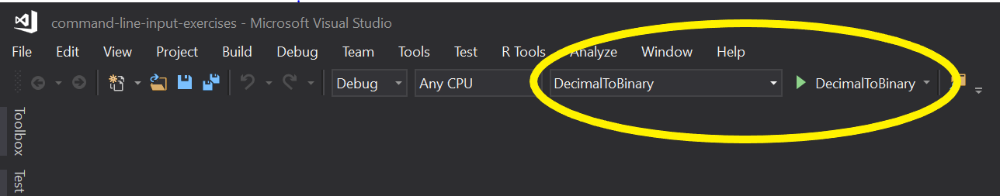

# Command-line programs

The purpose of this exercise is to provide students with the opportunity to practice and reinforce the skills they have learned during lecture related to building command line applications. In this exercise, you'll create command-line applications that:
   
   * Calculate and display the Fibonacci sequence for a given number.
   * Convert a series of numbers from decimal to binary.

## Learning objectives

After completing this exercise, you'll understand:

* How to create command line applications.
* How to prompt and accept user input in a command-line application.
* How to write output to the console in a command-line application.

## Evaluation criteria and functional requirements

* The project must not have any build errors.
* Appropriate variable names and data types are used.
* The input and output match what's stated in the following requirements.

### Fibonacci

The Fibonacci numbers are the integers in the following sequence:

    0, 1, 1, 2, 3, 5, 8, 13, 21, 34, 55, 89, 144, ...

By definition, the first two numbers in the Fibonacci sequence are 0 and 1, and each subsequent number is the sum of the previous two:

```
0 + 1 = 1
1 + 1 = 2
1 + 2 = 3
2 + 3 = 5
3 + 5 = 8
...
```

Write a command-line program which prompts the user for an integer value and display the Fibonacci sequence leading up to that number:

```
Please enter a number: 17

0, 1, 1, 2, 3, 5, 8, 13
```

If the input is a number that appears in the Fibonacci sequence, print the sequence up to *and including* that number:

```
Please enter a number: 34

0, 1, 1, 2, 3, 5, 8, 13, 21, 34
```

The Fibonacci sequence always starts with 0 and 1. If the input is 0 or a negative number, print "0, 1":

```
Please enter a number: 0

0, 1
```

If the input is 1, print "0, 1, 1":

```
Please enter a number: 1

0, 1, 1
```

### Decimal to binary

Write a command-line program which prompts the user for a series of decimal integer values separated by spaces. Each decimal integer is displayed along with its equivalent binary value.

```
Please enter in a series of decimal values (separated by spaces): 460 8218 1 31313 987654321

460 in binary is 111001100
8218 in binary is 10000000011010
1 in binary is 1
31313 in binary is 111101001010001
987654321 in binary is 111010110111100110100010110001
```

## Getting started

1. Open the `command-line-input-exercises.sln` solution in Visual Studio.
2. For each exercise, navigate to the corresponding project, and provide the code needed to fulfill the requirements in the `Main` method.
3. To verify that your application works as expected, select the project name from the dropdown in the menu bar that is displayed next to the execute button, and then click the button to run the program. Alternatively, you can right-click on the project name, then select `Debug -> Start new instance`, which displays the console for your application.



## Tips and tricks

* Many people have solved the Fibonacci sequence in many different ways. In fact, this may even come up during a technical interview. Rather than looking at the solutions that already exist, try to solve this problem on your own. If you do borrow a solution, take the time to understand what the code is actually doing.
* Take the time to review each of the tasks for the expected output, as well as the text you must use to prompt the user for information. Try to get this to match the specification as closely as possible when working through the exercise.
